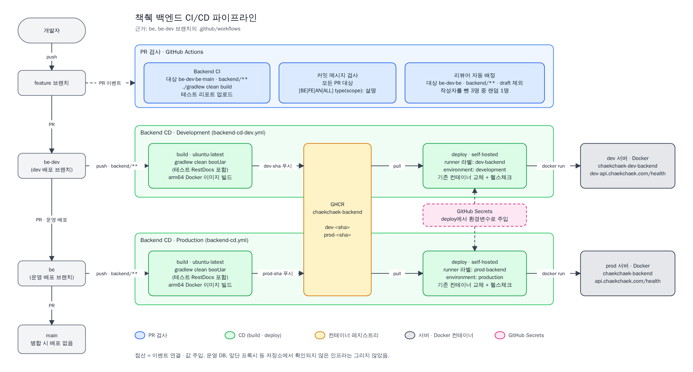

# Chaekchaek

## CI/CD

백엔드는 `be-dev`에 push하면 dev 서버로, `be`에 push하면 운영 서버로 GitHub Actions가 자동 배포한다.

단계별 설명은 [백엔드 CI/CD 파이프라인](./docs/ci-cd/ci-cd-pipeline.md), 편집용 원본은 [`ci-cd-pipeline.drawio`](./docs/ci-cd/ci-cd-pipeline.drawio)에 있다.
