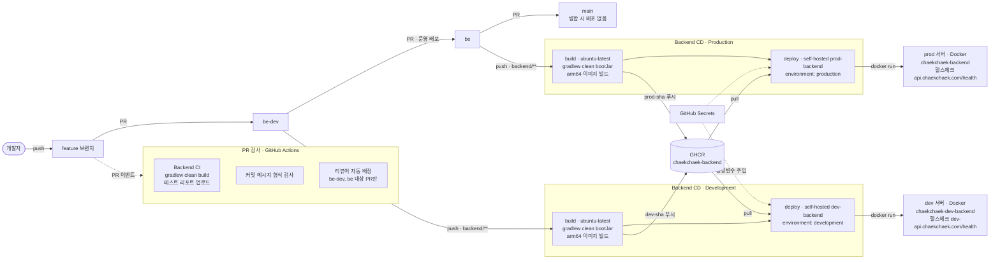

# 백엔드 CI/CD 파이프라인

> 기준: `be`, `be-dev` 브랜치의 `.github/workflows` (두 브랜치의 워크플로 파일은 동일하다).
> 범위: 백엔드(`backend/`)만. 프론트엔드, 안드로이드, 모니터링 배포는 다루지 않는다.

## 1. 한눈에 보기


편집 가능한 원본은 [`ci-cd-pipeline.drawio`](./ci-cd-pipeline.drawio)다. draw.io(app.diagrams.net)에서 열면 된다.

<details>
<summary>Mermaid 버전 (GitHub에서 바로 렌더링됨. 자동 배치라 위 그림보다 복잡해 보인다)</summary>



</details>

## 2. 브랜치 전략과 배포 시점

```
feature 브랜치 ──PR──▶ be-dev ──PR(운영 배포)──▶ be ──PR──▶ main
                         │                        │
                    push 시 dev 배포          push 시 운영 배포
```

| 브랜치 | 역할 | push 시 일어나는 일 |
|---|---|---|
| `feature` 브랜치 | 기능 개발 | 없음. PR을 열면 PR 검사가 돈다 |
| `be-dev` | 백엔드 통합 브랜치 | `backend/**`가 바뀌면 **dev 서버에 배포** |
| `be` | 운영 배포 브랜치 | `backend/**`가 바뀌면 **운영 서버에 배포** |
| `main` | 기본 브랜치 | 배포 워크플로 없음. `be`를 병합만 한다 |

`workflow_dispatch`로 수동 실행도 가능하다. 단, 각 CD는 해당 브랜치(`be-dev` 또는 `be`)에서 실행했을 때만 build가 돈다.

## 3. CI: PR 검사

PR을 열면 아래 세 워크플로가 GitHub Actions에서 실행된다.

| 워크플로 (파일) | 실행 조건 | 하는 일 |
|---|---|---|
| Backend CI (`backend-ci.yml`) | `be`, `be-dev`, `main` 대상 PR, `backend/**` 변경 | JDK 21(Liberica), Gradle 캐시 설정 후 `./gradlew clean build`로 빌드와 테스트를 실행하고, 테스트 리포트를 아티팩트로 올린다. 같은 브랜치에 새로 push하면 이전 실행은 취소된다 |
| 커밋 메시지 검사 (`commit-message.yml`) | 모든 PR | PR에 포함된 커밋 제목이 `[BE\|FE\|AN\|ALL] type(scope): 설명` 형식인지 검사한다. 형식이 틀리면 실패한다. `be`/`be-dev`의 이 워크플로는 merge 커밋을 허용하지 않는다 |
| 리뷰어 자동 배정 (`assign-backend-reviewer.yml`) | `be`, `be-dev` 대상 PR, `backend/**` 변경, draft 제외 | 백엔드 후보 3명 중 PR 작성자를 뺀 한 명을 무작위로 리뷰어로 요청한다 |

## 4. CD: 빌드와 배포

dev(`backend-cd-dev.yml`)와 운영(`backend-cd.yml`)은 구조가 같고 대상 값만 다르다. 각각 `build`와 `deploy` 두 job으로 나뉜다.

### build job (GitHub 제공 러너, ubuntu-latest)

1. JDK 21(Liberica)과 Gradle 캐시를 설정한다.
2. `./gradlew clean bootJar`를 실행한다. 이 빌드에는 테스트가 포함된다. 테스트가 만드는 REST Docs 스니펫으로 OpenAPI 명세를 생성하기 때문이다.
3. QEMU와 Buildx를 설정하고 `linux/arm64` Docker 이미지를 빌드한다.
4. 이미지를 GHCR(`ghcr.io/<저장소>/chaekchaek-backend`)에 푸시한다. 태그는 커밋 SHA를 쓴다.

### deploy job (self-hosted 러너)

`build`가 끝나면 서버에 설치된 self-hosted 러너에서 실행된다.

1. GHCR에 로그인하고 방금 푸시한 이미지를 `docker pull` 한다.
2. 기존 컨테이너를 중지하고 삭제한 뒤, 새 이미지로 `docker run -d --restart unless-stopped -p 8080:8080`을 실행한다.
3. 환경변수(DB 접속 정보, OAuth 키, JWT 시크릿 등)는 GitHub Secrets에서 주입한다.
4. 헬스체크 URL을 5초 간격으로 최대 30회 호출한다. 끝내 실패하면 컨테이너 로그 마지막 100줄을 출력하고 job을 실패 처리한다.

### dev와 운영의 차이

| 항목 | dev | 운영 |
|---|---|---|
| 워크플로 파일 | `backend-cd-dev.yml` | `backend-cd.yml` |
| 트리거 브랜치 | `be-dev` | `be` |
| 이미지 태그 | `dev-<sha>` | `prod-<sha>` |
| 러너 라벨 | `dev-backend` | `prod-backend` |
| GitHub environment | `development` | `production` |
| 컨테이너 이름 | `chaekchaek-dev-backend` | `chaekchaek-backend` |
| Docker 네트워크 | `chaekchaek_chaekchaek-network` (이미 있다고 가정) | `chaekchaek-network` (없으면 생성) |
| 헬스체크 | `https://dev-api.chaekchaek.com/health` | `https://api.chaekchaek.com/health` |

## 5. 사용 도구

| 구분 | 도구 |
|---|---|
| CI/CD 실행 | GitHub Actions (GitHub 제공 러너 + self-hosted 러너) |
| 빌드 | JDK 21(Liberica), Gradle |
| 컨테이너 | Docker(Buildx, QEMU), 베이스 이미지 `bellsoft/liberica-openjre-alpine:21` |
| 이미지 저장소 | GHCR (GitHub Container Registry) |
| 비밀값 | GitHub Secrets, GitHub environments(`development`, `production`) |

## 6. 한계와 확인하지 못한 것

- **`main`의 `backend-cd.yml`은 옛 버전이다.** `be`/`be-dev`의 현재 방식과 다르다. 이 문서는 `be`/`be-dev` 기준이다.
- **롤백이 없다.** 배포는 기존 컨테이너를 지우고 새로 띄우는 방식이라 교체하는 동안 서비스가 끊긴다. 헬스체크가 실패해도 이전 이미지로 되돌리지 않는다.
- **저장소에서 확인되지 않아 그림에서 뺀 것:** 운영 DB 위치, 앞단 프록시(ALB, nginx 등), 서버 대수, GitHub environment 보호 규칙, Secrets 값이 환경별로 분리되어 있는지, self-hosted 러너가 도는 서버의 실제 구성.
- **범위 밖:** 모니터링 배포(`monitoring-cd.yml`, `monitoring-cd-dev.yml`), 프론트엔드 배포, 안드로이드 CI.
