# 디자인 피드백 - 모바일과 공통

이 문서는 2026년 9월 4일에 기록된 디자인 피드백 중 모바일 앱과 전 플랫폼 공통 항목을 정리한다. 피드백은 개선 후보이며, 적용 여부와 구체적인 수치는 별도 검토가 필요하다.

- 원문: [Notion 디자인 피드백](https://app.notion.com/p/3d19e827212980df91bdcec4f5290899)
- 범위: 모바일, 공통
- 제외: 웹 전용 피드백

## 모바일

### 1. 화면 제목의 강조 방식

제목을 박스로 감싸기보다 굵은 글씨로 강조해 더 잘 보이게 한다.

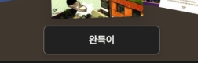

### 2. 브랜드 노출 위치

PC처럼 모바일 화면 왼쪽 상단에도 `책췍` 브랜드를 노출하는 방안을 검토한다.

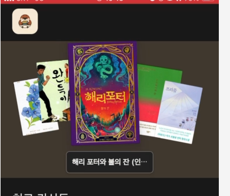

### 3. 별점 영역 모서리

별점 영역에도 둥근 모서리를 적용해 다른 요소와 시각적으로 맞춘다.

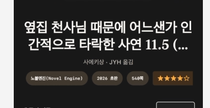

### 4. `MOST READ` 가독성

현재 문구의 가독성이 낮다. 문구를 유지한다면 색상 배경 위에 흰 글씨를 사용하는 방안을 검토한다.

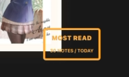

### 5. 정보 관계에 따른 여백

여백이 전체적으로 너무 균일하다. 관련 있는 요소는 가깝게 묶고, 관계가 다른 요소 사이에는 더 큰 간격을 둔다.

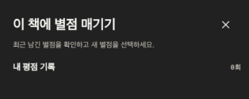

### 6. 갈색 배경 영역

화면에서 갈색 배경이 차지하는 영역을 더 넓히는 방안을 검토한다.

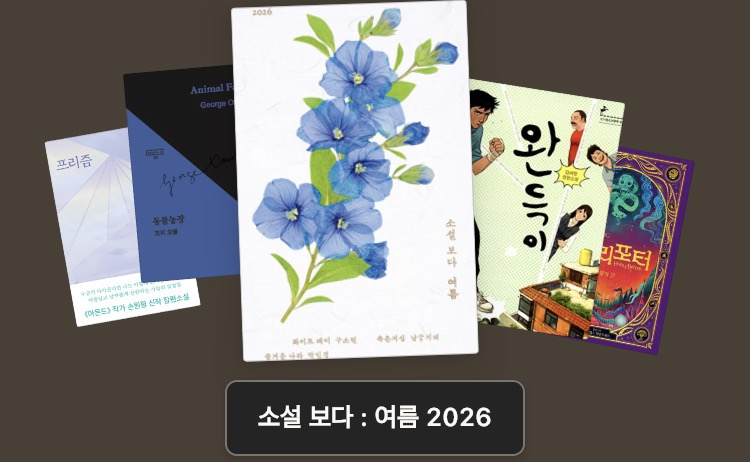

### 7. 버튼 모서리와 숫자 폰트

- 누를 수 있는 버튼들의 둥근 모서리 값을 통일한다.
- `감상` 옆 개수 숫자가 한글 폰트와 이질적으로 보이지 않도록 폰트를 조정한다.

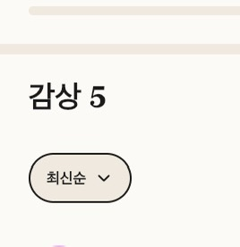

### 8. 필수 입력 표시

`느낀점` 옆의 `필수` 문구를 일반적인 필수 입력 기호인 `*`로 간소화하는 방안을 검토한다.

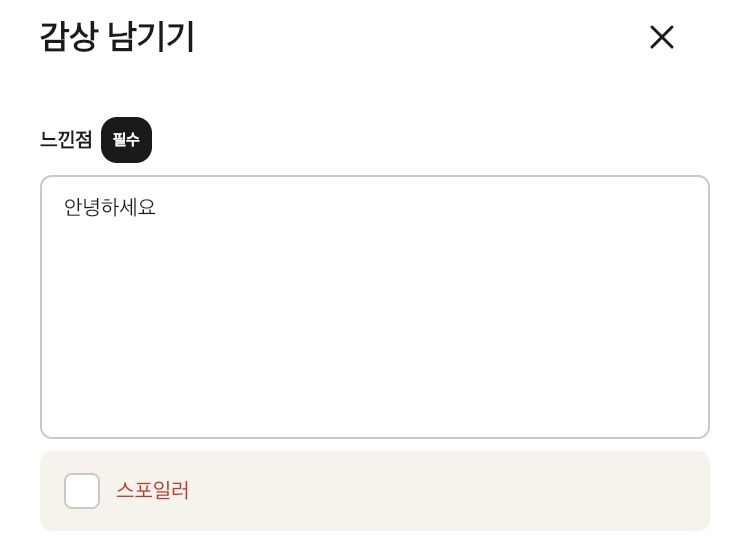

### 9. 이어서 읽기 구성

`이어서 읽기`를 간소화하고, 읽는 중인 책이 여러 권이면 한 번에 보여주는 방향을 검토한다.

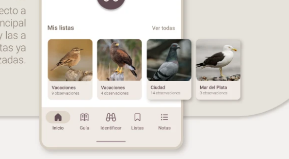

### 10. 구분선 색상

구분선은 경계가 느껴지되 눈에 두드러지지 않는 색상으로 조정한다.

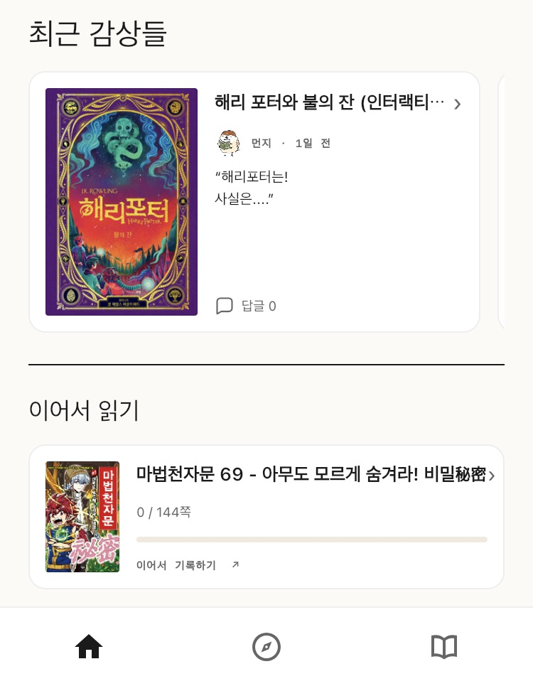

### 11. 감상 수정과 삭제 메뉴

감상의 수정과 삭제 동작을 드롭다운 메뉴로 묶는 방안을 검토한다.

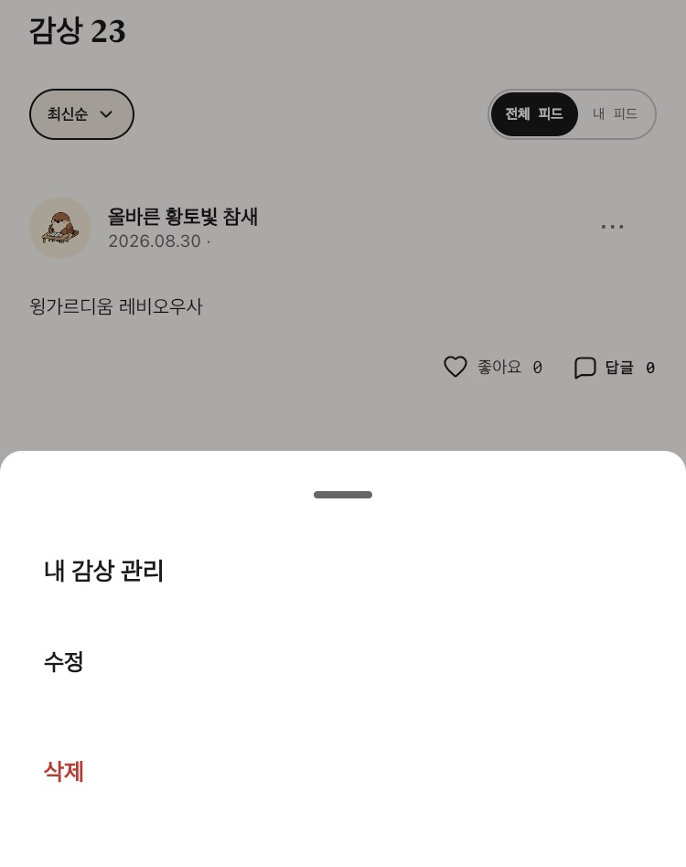

### 12. 홈 화면 책 큐레이션

홈 화면의 책 큐레이션 표현을 단순화하거나 여러 책을 공간감 있게 배치하는 방안을 검토한다. 책이 나뭇가지에 걸려 있는 듯한 표현도 후보로 제안되었다.

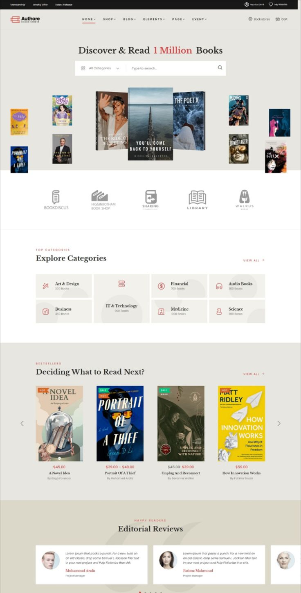

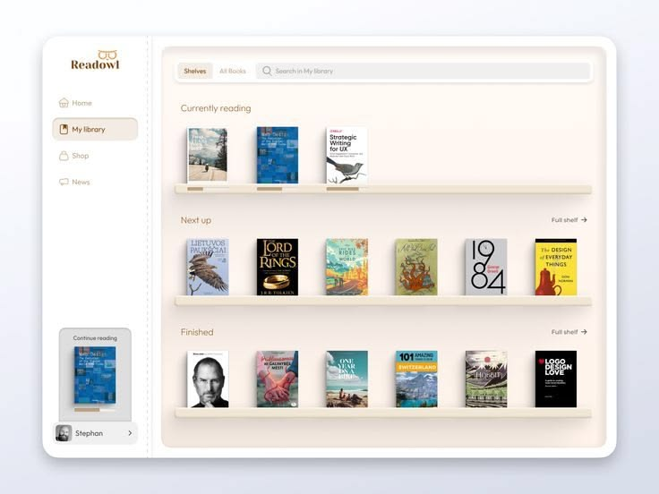

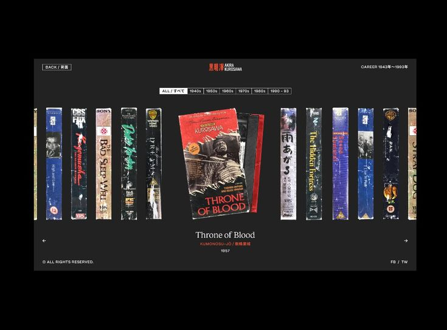

외부 참고 자료:

- [Book reading app concept](https://kr.pinterest.com/pin/963488914051201687/)
- [Pinterest 큐레이션 참고 자료](https://kr.pinterest.com/pin/650207264990952384/)
- [Newform Online 참고 자료](https://kr.pinterest.com/pin/893331276096006849/)

## 공통

### 1. 참새 콘셉트 색상

현재 화면에서는 참새를 나타내는 고유한 색과 특색이 충분히 드러나지 않는다. 서비스 전반에서 알아볼 수 있는 콘셉트 색상을 정의해 적용하는 방안을 검토한다.

- [Avistar UX/UI 참고 자료](https://www.behance.net/gallery/174168489/Avistar-Diseno-UXUI?utm_source=Pinterest&utm_medium=organic)

### 2. 익숙한 상호작용 기호 유지

`좋아요`를 벼와 같은 서비스 고유 기호로 바꾸지 않는다. 사용자가 이미 학습한 일반적인 좋아요 기호를 유지한다.

### 3. 소셜 로그인 공식 양식 준수

Google과 Apple 로그인 버튼은 각 플랫폼의 공식 디자인 지침을 따른다.

- [Google 계정으로 로그인 브랜드 가이드라인](https://developers.google.com/identity/branding-guidelines?hl=ko)
- [Apple로 로그인 Human Interface Guidelines](https://developer.apple.com/kr/design/human-interface-guidelines/sign-in-with-apple)

### 4. 캐릭터 콘셉트 참고

참새 캐릭터에 직업과 성격이 느껴지는 설정을 부여할 때, 디자인 회사에서 일하는 햄스터 콘셉트를 참고한다.

- [정서불안 김햄찌](https://www.youtube.com/@%EC%A0%95%EC%84%9C%EB%B6%88%EC%95%88%EA%B9%80%ED%96%84%EC%B0%8C)
